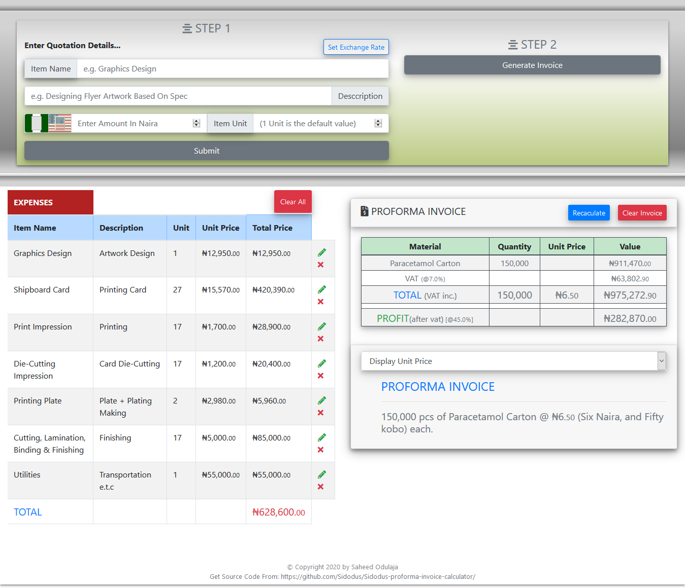
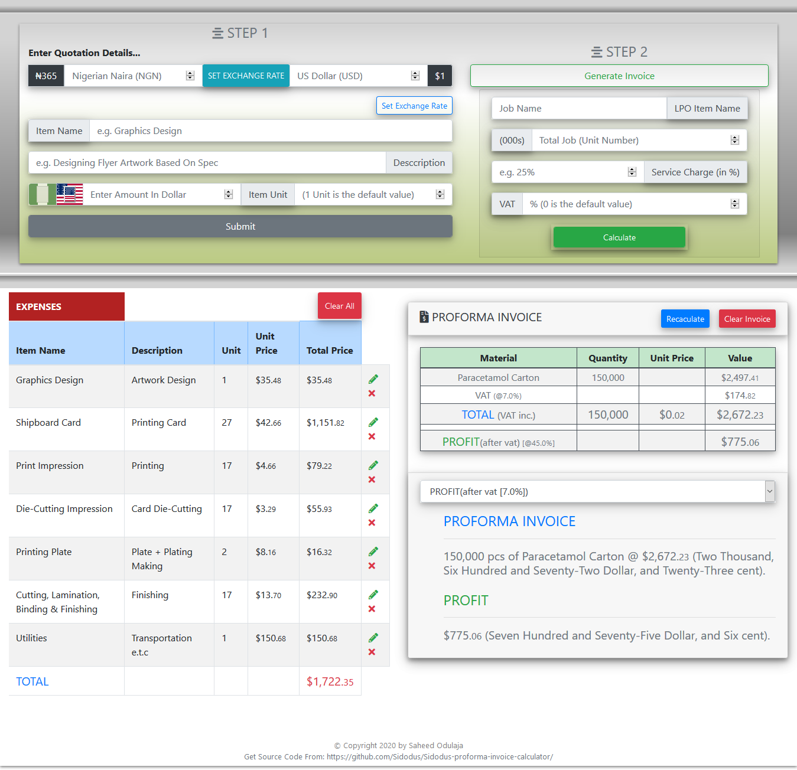
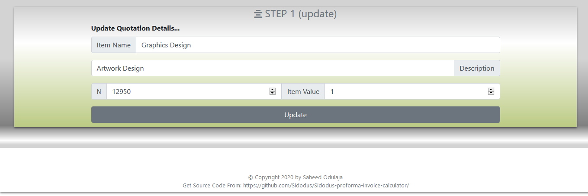

# PROFORMA INVOICE CALCULATOR

==============================
version 1.1.0

<h1 align="center">
  
  
    
</h1>

<blockquote align="center">
    <em>Proforma Invoice Calculator</em> is an invoice calculator which calculates how much should be charged per project in just 2 STEPS
</blockquote>

# UPDATE

- \*). Improved calculation algorithm
- \*). Changed background calculation algorithm to 5 decimal numbers instead of the initial 2 decimal. e.g. 38.27448 instead of 38.27
- \*). Number output is still in 2 decimal place but with better accuracy. e.g. ₦38.28 instead of ₦38.27

# USAGE...

# Calculate Your Invoice In 2 Steps

- \1). Input All Expences Through Step 1
- \2). Input The Invoice Details In Step 2
- \3). Thats all & You See The Magic.

- \*). Applicatiion Is Optimised With Nigerian Naira ([NGN] ₦) & US Dollar ([USD] \$)
- \*). Users Can Also Set An Exchange Rate Value Btween NGN & USD (default exchange rate is set at ₦365 to \$1)

See Proforma Invoice Calculator At Work Here [Proforma Invoice Calculator](https://sidodus.github.io/Sidodus-proforma-invoice-calculator/)

Created With React.js & Redux State Management:

> Proforma Invoice Calculator is Developed By Saheed Odulaja During A React / Redux Practice Session.
> Feel Free To Fork This Repository as There Is Always Room For Improvement.
> Also Be Kind Enough To Leave A STAR As A Mark Of Encouragement :)
