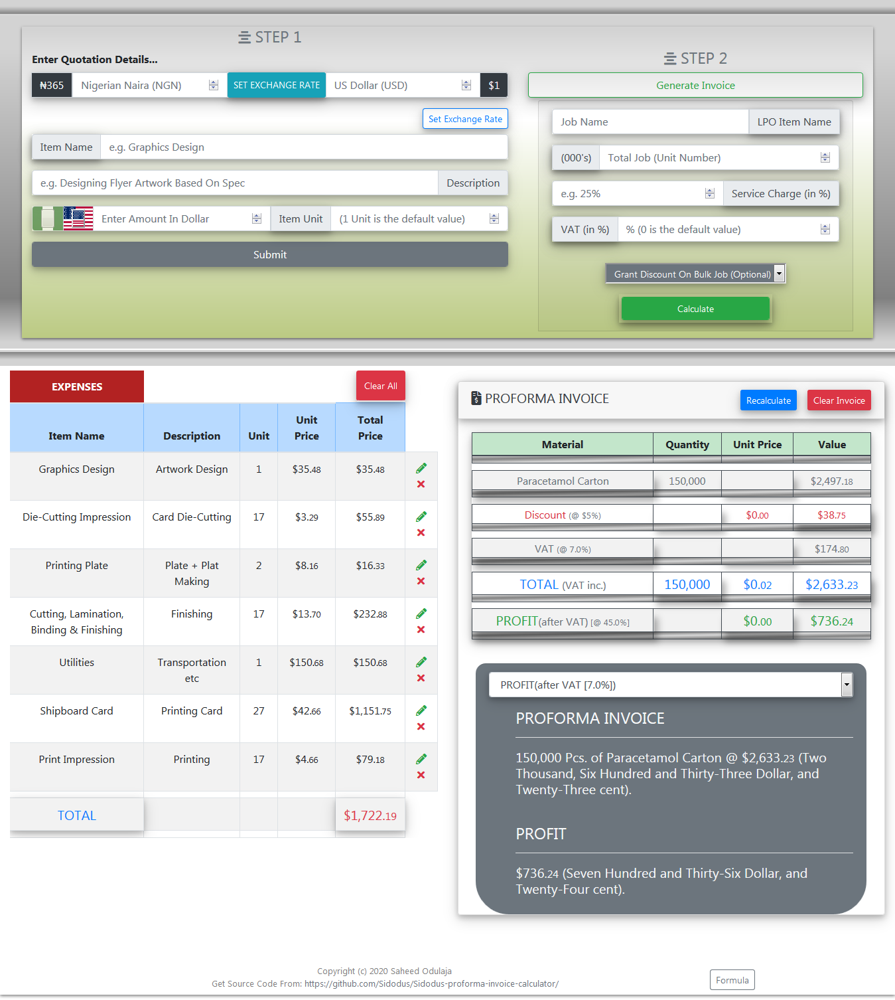

<h1>PROFORMA INVOICE CALCULATOR</h1>
<h6 style="color: blue; margin-top: -1rem;"><em>Version 3.0.0</em></h6>

  
  
  
  

<blockquote align="center">
  <em>Proforma Invoice Calculator</em> is an invoice calculator which calculates
  how much should be charged per project in just 2 STEPS.
</blockquote>

<h2 align="center">USAGE...</h2>

<h3>Calculate Your Contract Invoice (Project Charges) In Just 2 Steps...</h3>

<ol>
  <li>Input All Expenses Through Step 1.</li>
  <li>Input The Invoice Details In Step 2.</li>
  <li>That's all & You See The Magic.</li>
  <ul style="list-style-type: disc">
    <li>
      Application Is Optimized With Nigerian Naira ([NGN] ₦) & US Dollar ([USD]
      $).
    </li>
    <li>
      Users Can Also Set An Exchange Rate Value Between NGN & USD (default
      exchange rate is set at ₦365 to $1).
    </li>
  </ul>
</ol>

<h4>UPDATE</h4>
<h6 style="color: blue; margin-top: -0.7rem;"><em>Version: 3.0.0</em></h6>
<ol>
  <li>Introduced Discount Option.</li>
  <ul style="list-style-type: disc">
    <li>Users Can now grant their clients discount on jobs.</li>
  </ul>
  <li>Improved User Experience (UX).</li>
  <li>
    Fixed Bug.
  </li>
    <ul style="list-style-type: disc">
      <li>Fixed bug preventing entering of multiple expenses details.</li>
    </ul>
</ol>

<h4>UPDATE</h4>
<h6 style="color: blue; margin-top: -0.7rem;"><em>Version: 2.0.0</em></h6>

<ol type="i">
  <li>Perfected the calculation algorithm.</li>
  <li>
    Now users can set, or change exchange rate values at any time within the
    application.
  </li>
  <ul style="list-style-type: disc">
    <li>
      Naira Exchange Rate Value can now be set to be stronger than Dollar
      Exchange Rate Value e.g. ₦1 = $7.
    </li>
  </ul>
  <li>
    While changing the exchange rate, users must define the BASE Currency.
  </li>
  <ul style="list-style-type: disc">
    <li>
      A Base Currency is the constant currency in which the second currency
      would be recalculated from.
    </li>
    <li>
      
e.g.

      <b>Original FX Ratio = 1:365 </b>  
      1 Pack of pencil @ Original FX Ratio = <code>$1 to ₦365</code>  
      <b>
        If Base Currency = Dollar && New FX
        Ratio = <code>1:400</code>
      </b>
       
      1 Pack of pencil @ New FX Ratio = <code>$1 to ₦400</code>  
      <b>
        If Base Currency = Naira && New FX
        Ratio = <code>1:400</code>
      </b>
       
      1 Pack of pencil @ New FX Ratio = <code>$0.91 to ₦365</code>  
    </li>
  </ul>
  <li>
    Testing proforma invoice with different exchange rate values is now possible
    after haven calculated proforma invoice.
    <ul style="list-style-type: disc">
      <li>
        You Would get Your Expenses Values & A NEW Proforma Invoice Based On
        Your New Exchange Rate.
      </li>
    </ul>
  </li>
  <li>
    Improved background calculation algorithm to MAXIMUM Calculated Decimal
    numbers instead of the previous 5 decimal place.
    <ul style="list-style-type: disc">
      <li>
        
e.g.

        <code>7 / 365 = 0.01917808219178082192, Instead of 0.01918</code>
      </li>
    </ul>
  </li>
  <li>Improved User Experience (UX).</li>
</ol>

<h4>UPDATE</h4>
<h6 style="color: blue; margin-top: -0.7rem;"><em>Version: 1.1.0</em></h6>

<ol>
  <li>Improved calculation algorithm.</li>
  <li>
    Changed background calculation algorithm to 5 decimal numbers instead of the
    initial 2 decimal. e.g. 38.27448 instead of 38.27
  </li>
  <li style="">
    Number output is still in 2 decimal place but with better accuracy. e.g.
    ₦38.28 instead of ₦38.27
  </li>
</ol>

See Proforma Invoice Calculator At Work Here [Proforma Invoice
Calculator](https://sidodus.github.io/Sidodus-proforma-invoice-calculator/)

<h6 style="margin: 1em;"><em>Created With React.js & Redux State Management</em></h6>

> Proforma Invoice Calculator is Developed By Saheed Odulaja During A
> React/Redux Practice Exercise. > Feel Free To Fork This Repository as There Is
> Always Room For Improvement. > Also Be Kind Enough To Leave A STAR As A Mark Of
> Encouragement :)
