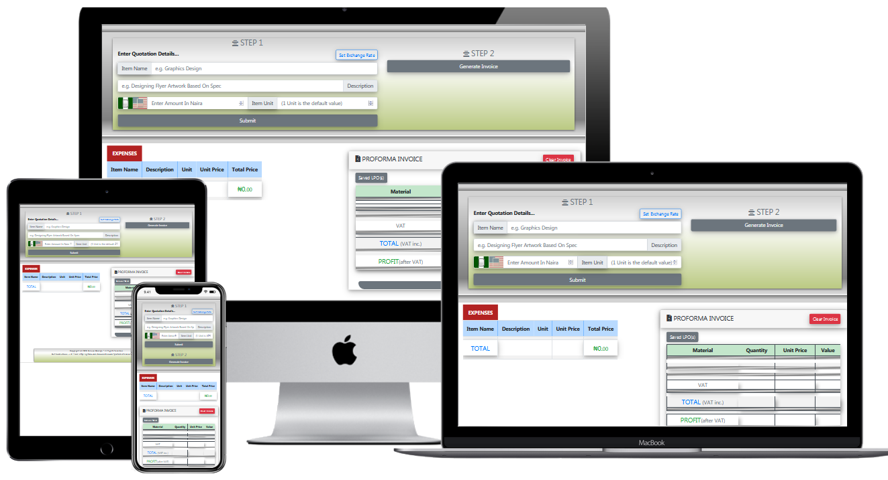

<h1>PROFORMA INVOICE CALCULATOR 👍</h1>
<h6 style="color: blue; margin-top: -1rem;"><em>Version 4.1.0</em></h6>

<h6 >
  1
  st Of It's Kind On The Internet
</h6>

   

  
  
  <!--  -->
  
  

 

<blockquote align="center">
  <em>
    Proforma Invoice Calculator Is An Application Developed For Calculating How Much To Bill Clients While Writing A Job Proposal / Proforma Invoice.
  </em>
</blockquote>

 

<h2 align="center">USAGE...</h2>

<h3>In Just 2 Steps, Proforma Invoice Calculator Would Calculate The Proposed Amount For Your Job Proposal / Proforma Invoice.</h3>

<ol>
  <li>Input All Expenses Through Step 1.</li>
  <li>Input The Invoice Details In Step 2.</li>
  <li>That's all & You See The Magic.</li>
  <ul style="list-style-type: disc">
    <li>
      Application Is Optimized With Nigerian Naira ([NGN] ₦) & US Dollar ([USD] $).
    </li>
    <li>
      Users Can Also Set An Exchange Rate Value Between NGN & USD (default exchange rate is set at ₦365 to $1).
    </li>
  </ul>
</ol>

<h3 align="center" color="gray">
<ins>NOTE</ins>:
  
<ul>
  <li>All Future Codes Updates From Version 2.0.0 Are Now Private</li>
  <li>Application Is Still Free To Use At <a href="https://sidodus.github.io/Sidodus-proforma-invoice-calculator/">Proforma Invoice Calculator<a/></li>
</ul>
</h3>

<h4><ins>UPDATE</ins></h4>
<h6 margin-bottom="-5px"><em>Version: 4.1.0</em></h6>
<ol>
  <li>Introduced An About Page.</li>
  <ul style="list-style-type: disc">
    <li>Improved UX.</li>
  </ul>
</ol>

<h4><ins>UPDATE</ins></h4>
<h6 margin-bottom="-5px"><em>Version: 4.0.0</em></h6>
<ol>
  <li>Introduced Saving Of Processed Proforma Invoice To Storage.</li>
  <ul style="list-style-type: disc">
    <li>Saved Proforma Invoice Can Be Pulled From Storage Back To Application Home Page.</li>
  </ul>
  <li>Introduced Google Analytics</li>
</ol>

<h4><ins>UPDATE</ins></h4>
<h6 margin-bottom="-5px"><em>Version: 3.0.1</em></h6>
<ol>
  <li>Perfected VAT calculation to equal (=) "VAT % * (Total Value - Discount)".</li>
  <ul style="list-style-type: disc">
    <li>VAT calculation now considers discounted amount during calculation. This means discount given would be deducted from total value before VAT is calculated. This is because discount on job would reduce the Total Proforma Invoice Amount and VAT should only be calculated on the invoice total value.</li>
  </ul>
  <li>Improved Formula Presentation.</li>
</ol>

<h4><ins>UPDATE</ins></h4>
<h6 margin-bottom="-5px"><em>Version: 3.0.0</em></h6>
<ol>
  <li>Introduced Discount Option.</li>
  <ul style="list-style-type: disc">
    <li>Users Can now grant their clients discount on jobs.</li>
  </ul>
  <li>Improved User Experience (UX).</li>
  <li>
    Fixed Bug.
  </li>
    <ul style="list-style-type: disc">
      <li>Fixed bug preventing entering of multiple expenses details.</li>
    </ul>
</ol>

<h4><ins>UPDATE</ins></h4>
<h6 margin-bottom="-5px"><em>Version: 2.0.0</em></h6>

<ol type="i">
  <li>Perfected the calculation algorithm.</li>
  <li>
    Now users can set, or change exchange rate values at any time within the
    application.
  </li>
  <ul style="list-style-type: disc">
    <li>
      Naira Exchange Rate Value can now be set to be stronger than Dollar
      Exchange Rate Value e.g. ₦1 = $7.
    </li>
  </ul>
  <li>
    While changing the exchange rate, users must define the BASE Currency.
  </li>
  <ul style="list-style-type: disc">
    <li>
      A Base Currency is the constant currency in which the second currency
      would be recalculated from.
    </li>
    <li>
      
e.g.

      <b>Original FX Ratio = 1:365 </b>  
      1 Pack of pencil @ Original FX Ratio = <code>$1 to ₦365</code>  
      <b>
        If Base Currency = Dollar && New FX
        Ratio = <code>1:400</code>
      </b>
       
      1 Pack of pencil @ New FX Ratio = <code>$1 to ₦400</code>  
      <b>
        If Base Currency = Naira && New FX
        Ratio = <code>1:400</code>
      </b>
       
      1 Pack of pencil @ New FX Ratio = <code>$0.91 to ₦365</code>  
    </li>
  </ul>
  <li>
    Testing proforma invoice with different exchange rate values is now possible
    after haven calculated proforma invoice.
    <ul style="list-style-type: disc">
      <li>
        You Would get Your Expenses Values & A NEW Proforma Invoice Based On
        Your New Exchange Rate.
      </li>
    </ul>
  </li>
  <li>
    Improved background calculation algorithm to MAXIMUM Calculated Decimal
    numbers instead of the previous 5 decimal place.
    <ul style="list-style-type: disc">
      <li>
        
e.g.

        <code>7 / 365 = 0.01917808219178082192, Instead of 0.01918</code>
      </li>
    </ul>
  </li>
  <li>Improved User Experience (UX).</li>
</ol>

<h4><ins>UPDATE</ins></h4>
<h6 margin-bottom="-5px"><em>Version: 1.1.0</em></h6>

<ol>
  <li>Improved calculation algorithm.</li>
  <li>
    Changed background calculation algorithm to 5 decimal numbers instead of the
    initial 2 decimal. e.g. 38.27448 instead of 38.27
  </li>
  <li>
    Number output is still in 2 decimal place but with better accuracy. e.g.
    ₦38.28 instead of ₦38.27
  </li>
</ol>

See Proforma Invoice Calculator At Work Here [Proforma Invoice
Calculator](https://sidodus.github.io/Sidodus-proforma-invoice-calculator/)

<h6 style="margin: 1em;"><em>Created With React.js & Redux State Management</em></h6>

> Proforma Invoice Calculator Was Developed By Saheed Odulaja Using React.js & Redux State Management.
> Feel Free To Fork This Repository.
> Also Be Kind Enough To Leave A STAR 🌟 As A Mark Of Encouragement 😃.
